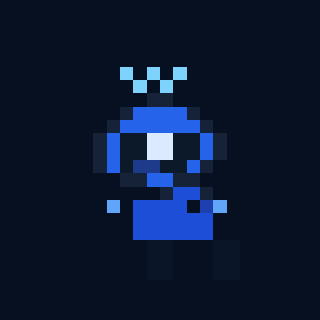
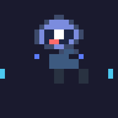
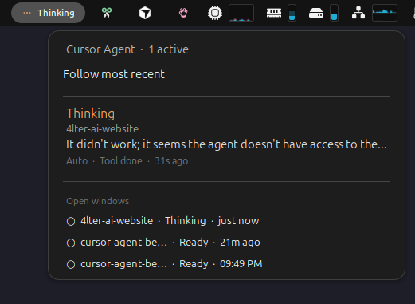
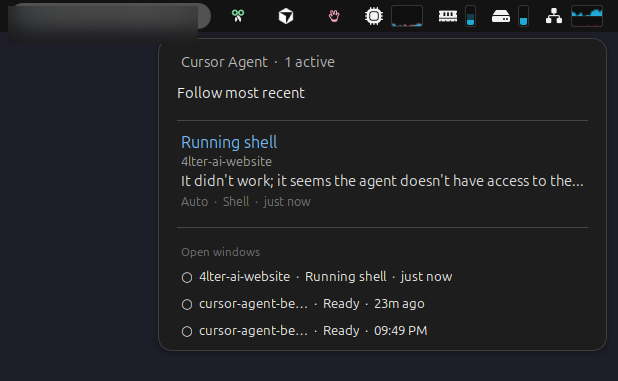

<p align="center">
  
</p>

# Cursor Agent Beacon

<p align="center">
  <strong>See what your Cursor agent is doing without watching the chat.</strong><br>
  Top-bar status on Ubuntu/GNOME — and optionally a desk display with a pixel-robot status face.
</p>

[](https://github.com/suribe06/cursor-agent-beacon/actions/workflows/ci.yml)
[](https://pypi.org/project/cursor-agent-beacon/)
[](LICENSE)
[](https://www.python.org/downloads/)

Agents keep working while you alt-tab, walk away, or switch projects. Beacon turns native [Cursor Hooks](https://cursor.com/docs/hooks) into glanceable states — so you know when it's thinking, running a shell, done, or stuck — without digging through the chat.

**Who it's for:** Cursor users on **Ubuntu / GNOME** (top-bar panel). Hooks + CLI work anywhere Cursor runs; the desk display is optional.

## See it

<p align="center">
  
</p>

<p align="center"><em>Default theme — thinking → running shell → success. Bring your own GIFs anytime.</em></p>

| Thinking | Running shell | Success | Error |
| --- | --- | --- | --- |
|  |  |  |  |

GNOME top-bar panel (multi-session: state, tool, turn timer):

| Thinking | Running shell |
| --- | --- |
|  |  |

**Try the desk-display simulator:** [live preview](https://suribe06.github.io/cursor-agent-beacon/) · or open [`preview/display-simulator.html`](preview/display-simulator.html) locally.

## Quick start (desktop)

```bash
pip install cursor-agent-beacon
cursor-agent-beacon setup
```

Restart Cursor. On Ubuntu/GNOME, reload the shell if the top-bar panel does not appear (`Alt+F2` → `r` on X11, or log out/in on Wayland).

```bash
cursor-agent-beacon doctor
cursor-agent-beacon status    # after an Agent chat
```

You're done when `doctor` is green and the top bar shows agent state.

<details>
<summary>Install from git (development)</summary>

```bash
git clone https://github.com/suribe06/cursor-agent-beacon.git
cd cursor-agent-beacon
./setup.sh
```

</details>

More detail: [Getting Started](docs/getting-started.md).

## Two paths

| Path | What you get | Needs |
| --- | --- | --- |
| **Desktop** (default) | GNOME top-bar panel + `doctor` / `status` CLI | Ubuntu/GNOME + Cursor |
| **Desk display** (optional) | Same status on a physical 480×480 panel via a local bridge | ESP32 board + `pip install "cursor-agent-beacon[bridge]"` |

The desk display ships firmware and flash notes for the **VIEWE** 480×480 panel; other boards can speak the same serial protocol. See [Hardware displays](docs/hardware.md).

## Features

- Glanceable agent states: `idle`, `waiting`, `thinking`, `running_shell`, `running_mcp`, `success`, `error`
- Multi-session GNOME panel (focused session + open workspaces)
- One-shot setup / uninstall; fail-open hooks (never block Cursor)
- Default pixel-robot theme + **custom GIF themes** (`themes/custom/`)
- Optional HTTP → serial bridge for a desk panel

## Custom themes

Drop your own 480×480 GIFs under `themes/custom/<name>/` — Pathfinder sprites, radars, whatever fits your desk. The robot is just the default face.

```bash
export CURSOR_AGENT_BEACON_THEME=your-theme
```

See [Display themes](docs/display-themes.md) and [`themes/README.md`](themes/README.md).

## How it works

Cursor fires hook events during the agent lifecycle — the model does not self-report. Beacon maps those events to high-level states and publishes them through sinks (file, log, HTTP).

```text
Cursor → ~/.cursor/hooks.json → cursor-agent-beacon run → mapper → sinks
                                                      ↓
                              ~/.local/share/cursor-agent-beacon/ → GNOME panel
```

Details: [`docs/architecture.md`](docs/architecture.md).

<details>
<summary>Environment variables</summary>

| Variable | Default | Description |
| --- | --- | --- |
| `CURSOR_AGENT_BEACON_LOG` | `true` | Emit JSON lines to stderr |
| `CURSOR_AGENT_BEACON_FILE` | `true` | Write latest status file |
| `CURSOR_AGENT_BEACON_STATUS_FILE` | `~/.local/share/cursor-agent-beacon/status.json` | Status snapshot path |
| `CURSOR_AGENT_BEACON_HTTP_URL` | unset | Bridge `POST /status` endpoint |
| `CURSOR_AGENT_BEACON_BRIDGE_HOST` | `127.0.0.1` | Bridge bind address |
| `CURSOR_AGENT_BEACON_BRIDGE_PORT` | `8765` | Bridge HTTP port |
| `CURSOR_AGENT_BEACON_SERIAL_PORT` | unset | ESP32 serial device (dry-run if unset) |
| `CURSOR_AGENT_BEACON_SERIAL_BAUD` | `115200` | Serial baud rate |
| `CURSOR_AGENT_BEACON_THEME` | `standard` | Theme id (`standard` or custom name) |
| `CURSOR_AGENT_BEACON_THEMES_DIR` | packaged / repo `themes/` | Theme packs root |
| `CURSOR_AGENT_BEACON_REDACT_CONTENT` | `false` | Hide prompt/response text in status |

</details>

## Project status

| Component | Status |
| --- | --- |
| Python hook handler | ✅ shipped |
| Setup + doctor / status CLI | ✅ shipped |
| Multi-session file sink | ✅ shipped |
| GNOME status panel | ✅ usable (polishing) |
| Standard GIF theme | ✅ bundled |
| Custom GIF themes | ✅ `themes/custom/` |
| Local bridge service | ✅ shipped |
| VIEWE desk-display firmware | ✅ in-repo (`firmware/viewe/`) |

See [`docs/roadmap.md`](docs/roadmap.md).

## Documentation

- [Getting Started](docs/getting-started.md)
- [GNOME Status Panel](docs/gnome-panel.md)
- [Display themes](docs/display-themes.md)
- [Hooks Reference](docs/hooks.md)
- [Architecture](docs/architecture.md)
- [Hardware displays](docs/hardware.md)
- [Hardware — VIEWE setup](docs/hardware-viewe.md)
- [Roadmap](docs/roadmap.md)
- [Changelog](CHANGELOG.md)

## Contributing

See [CONTRIBUTING.md](CONTRIBUTING.md). Please read the [Code of Conduct](CODE_OF_CONDUCT.md) before participating.

Report security issues privately — see [SECURITY.md](SECURITY.md).

## Development

```bash
./setup.sh
source .venv/bin/activate
pip install -e ".[dev,bridge]"
pytest -m "not smoke"
ruff check src tests
ruff format --check src tests
pyright
```

Bridge systemd unit: [`packaging/cursor-agent-beacon-bridge.service`](packaging/cursor-agent-beacon-bridge.service) · install script: `./scripts/install-bridge-service.sh`

## License

MIT — see [LICENSE](LICENSE).
