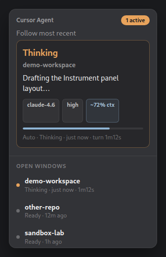
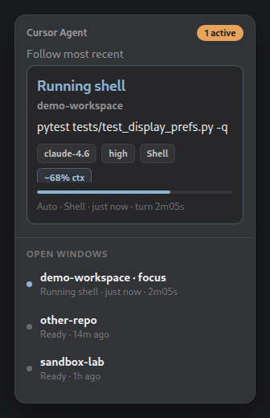

# GNOME Status Panel

Top-bar indicator for Ubuntu / GNOME: focused Cursor agent session (state, tool, turn timer) plus a menu of open workspace sessions.





## Requirements

- Ubuntu / GNOME Shell 46–50 (Ubuntu 24.04 through 26.04)
- User-level hooks installed (see below)

## Install

From the repo root (hooks + panel in one step):

```bash
./setup.sh
```

Hooks only:

```bash
./setup.sh --hooks-only
```

GNOME panel only (after `./setup.sh`):

```bash
.venv/bin/cursor-agent-beacon install-gnome
```

Then restart Cursor and GNOME Shell (`Alt+F2` → `r` on X11).

## Data flow

```text
Cursor hooks → ~/.local/share/cursor-agent-beacon/
                 registry.json
                 sessions/<id>.json
                 status.json
                      ↓ file watch + fallback poll
               GNOME panel (gnome-extension/)
```

The panel trusts Python's `focused_conversation_id` from `status.json` / `registry.json` (no duplicate focus logic in JS).

## Panel features

- Shows focused session from Python registry; badge when multiple agents are active
- Menu lists active sessions; click to **pin** (★)
- Turn timer when a session is busy (`startedAt`)
- Human-readable timestamps (`2m ago`, not ISO)
- Optional panel side: `gsettings set org.gnome.shell.extensions.cursor-status-panel panel-side left`

## Source

Extension lives in [`gnome-extension/`](../gnome-extension/).

### Look

The popup uses the **Instrument** layout (status card + chips + context meter + session dots). Design options are archived in [`preview-menu.html`](../gnome-extension/preview-menu.html). After updating the extension, log out on Wayland (or Alt+F2 `r` on X11) to reload Shell JS.
